# <!--fit--> Getting Started with <br/> Compliance & Governance <br/>using Azure Policy

<style scoped>a { color: #36d; }</style>

<!--
Welcome!
-->

---

## <!--fit--> :raising_hand_man: :raising_hand: :raising_hand_woman:

<!--
Ice-breaker: Remember the names of people around you.
-->

---

## Agenda

- Recapitulation of DevOps Journey
- Compliance & Governance
- Basics of Azure Policy

---

### 👨🏻‍💻 _DevOps, DevSecOps, GitOps_ 👩‍💻

<!--
Used as a set of practices and tools, DevOps integrates and automates the work of software development (Dev) and IT operations (Ops) as a means for improving and shortening the systems development life cycle.

In 2009, the first conference named DevOps Days was held in Ghent, Belgium. The conference was founded by Belgian consultant, project manager and agile practitioner Patrick Debois. The conference has now spread to other countries.

As of 2014, the annual State of DevOps report was published by Nicole Forsgren, Gene Kim, Jez Humble and others.

Forsgren was CEO and co-founder of DevOps Research and Assessment LLC (DORA) with Jez Humble and Gene Kim. In 2018 DORA was purchased by Google.

When security teams adopt a DevOps approach, security is an active and integrated part of the development process. This is called DevSecOps.
https://www.atlassian.com/devops

GitOps uses Git repositories as a single source of truth to deliver infrastructure as code.
https://www.redhat.com/en/topics/devops/what-is-gitops
-->

---

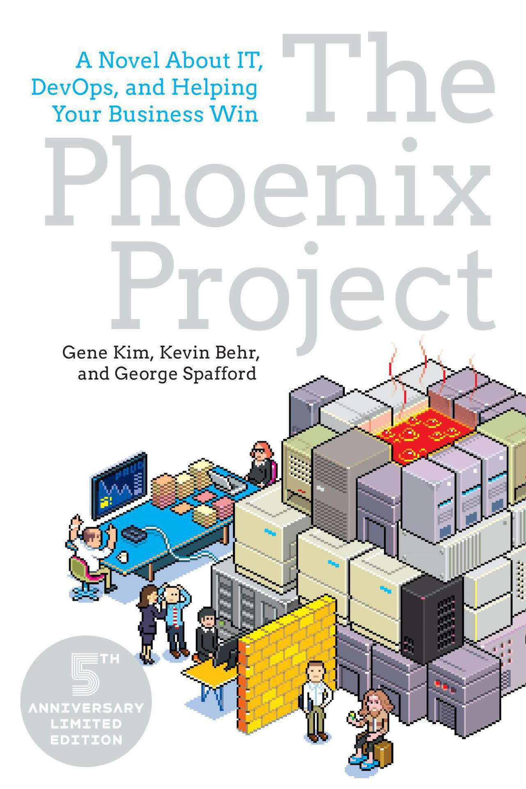
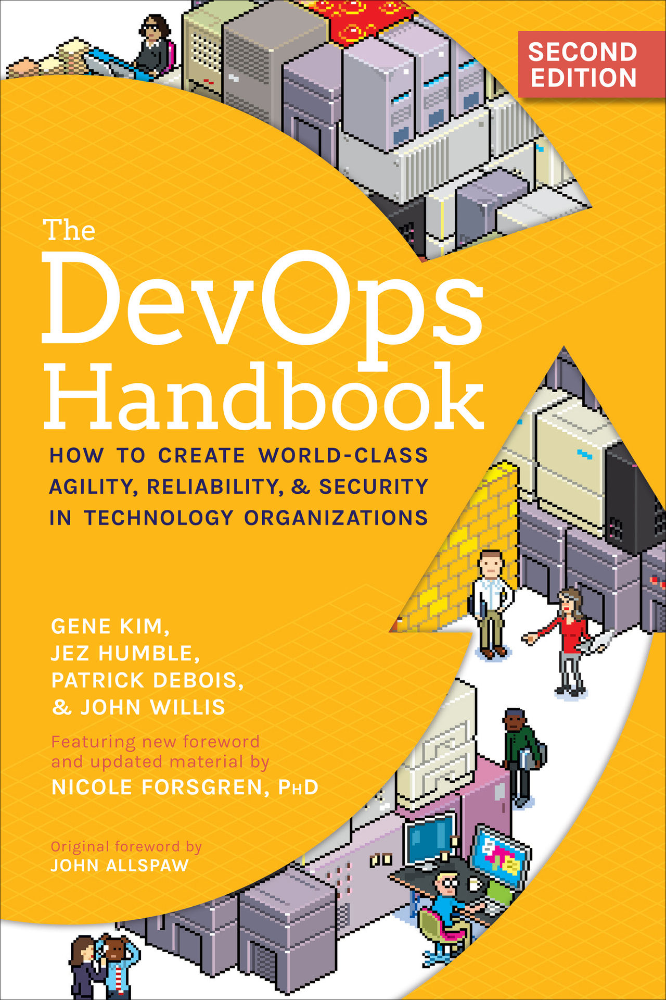
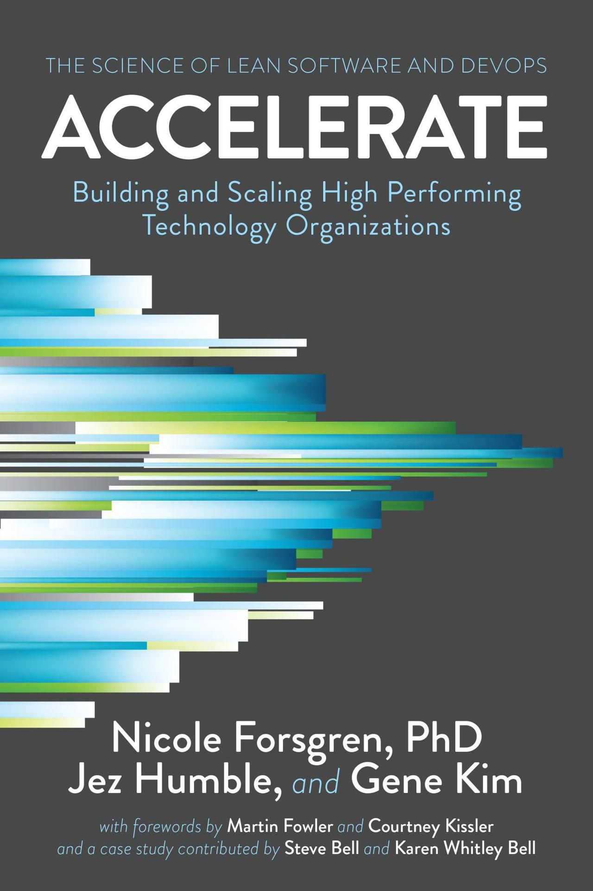
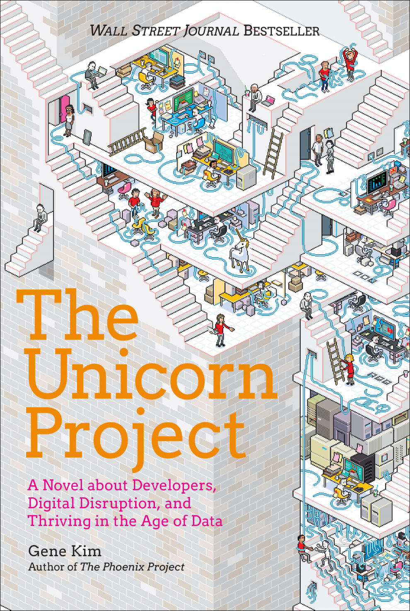

<!--
Some speaker notes here that might be useful.

The Phoenix Project: A Novel about IT, DevOps, and Helping Your Business Win
Publisher : IT Revolution Press; Reprint edition (October 16, 2014)

The DevOps Handbook: How to Create World-Class Agility, Reliability, & Security in Technology Organizations
Publisher : IT Revolution Press; Illustrated edition (October 6, 2016)

Accelerate: The Science of Lean Software and DevOps: Building and Scaling High Performing Technology Organizations
Publisher : IT Revolution Press; 1st edition (March 27, 2018)

24 Key Capabilities inside 5 Categories:
- Continuous Delivery
- Architecture
- Product and Process
- Lean Management and Monitoring
- Cultural

Four Key Metrics:
- Change Lead Time
- Deployment Frequency
- Change Failure Rate
- Mean Time to Recovery

The Unicorn Project
Publisher : IT Revolution Press (November 26, 2019)
-->

---

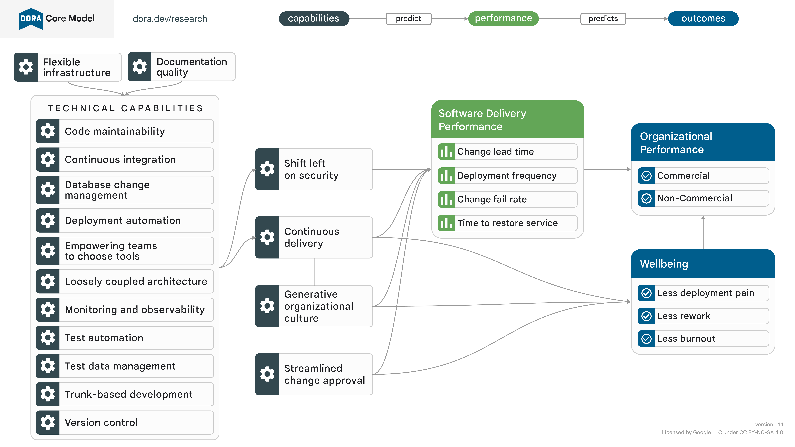

<style scoped>img[alt="image"] {
    border: 3px solid #008AD7;
    width: 80%;
}
</style>

---

### [The Four Keys](https://github.com/dora-team/fourkeys)

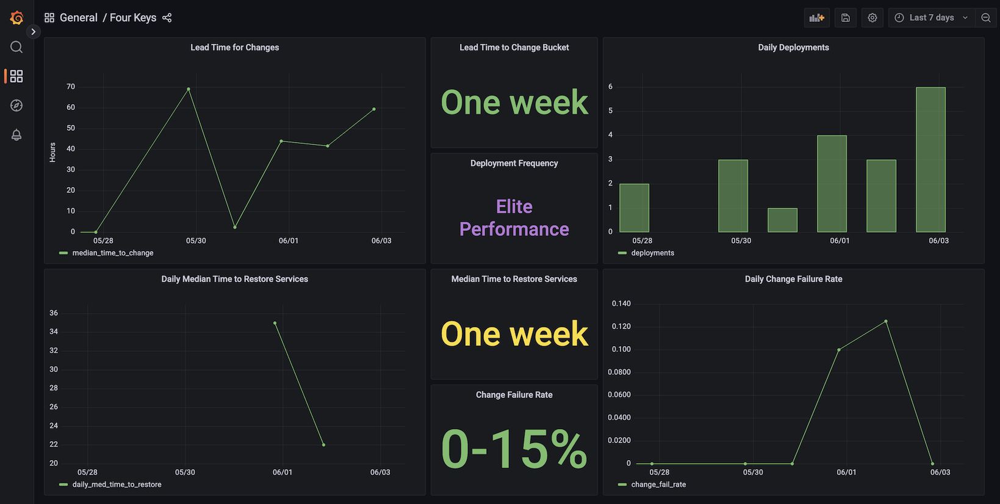

<style scoped>img[alt="image"] {
    border: 3px solid #008AD7;
    width: 80%;
}
</style>

<!--
The Four Keys is an open source project which provides a bootstrapper to create a metrics aggregator and dashboard for the four key DORA software delivery metrics (Deployment Frequency, Lead Time for Changes, Time to Restore Services, Change Failure Rate). Visit https://bit.ly/dora-fourkeys to learn how to install it and connect it to data sources including your version control and CI/CD systems.

https://github.com/dora-team/fourkeys/blob/94ce09fcf7ba157ba12c60671269a5298b6580cd/images/dashboard.png
https://github.com/dora-team/fourkeys/blob/main/images/dashboard.png
-->

---

### DevOps, DevSecOps, GitOps <br/><br/> 👨🏽‍💻 _Site Reliability Engineering (SRE)_ 👩🏽‍💻

<!--
Site Reliability Engineering (SRE) uses software engineering to automate IT operations tasks that would normally be performed by system administrators.

DevOps is going to automate deployment. They’re going to automate tasks and features. SRE is going to automate redundancy, and they’re going to automate manual tasks that they can turn into programmatic tasks to keep the stack up and running.

SRE teams focus on monitoring metrics related to latency, traffic, uptime and error rates to ensure the reliability and availability of systems.

https://www.splunk.com/en_us/blog/learn/sre-vs-devops-vs-platform-engineering.html
-->

---

### DevOps, DevSecOps, GitOps <br/> Site Reliability Engineering (SRE) <br/><br/> 👨🏻‍💻 _Platform Engineering_ 👩🏻‍💻

<!--
Some speaker notes here that might be useful.

In contrast, Platform Engineering teams measure:
Infrastructure productivity like lead time, deployment frequency, etc.)
Stability like MTTR, change failure rate, etc.
Efficiency metrics like resource allocation to ensure efficient management of infrastructure.

https://www.splunk.com/en_us/blog/learn/sre-vs-devops-vs-platform-engineering.html

Gartner Top 10 Strategic Technology Trends for 2023
https://www.gartner.com/en/articles/gartner-top-10-strategic-technology-trends-for-2023

Platform Engineering provides a curated set of tools, capabilities and processes that are packaged for easy consumption by developers and end users. It will increase end users’ productivity and reduce the burden on development teams.
-->

---

### DevOps, DevSecOps, GitOps <br/> Site Reliability Engineering (SRE) <br/> Platform Engineering <br/><br/> ✨ _Governance Engineering_ ✨

<!--

-->

---


“Good strategy and good governance are the grease and guide rails for success.” - [Bill Bensing](https://www.amazon.com/Investments-Unlimited-Compliance-Thriving-Digital/dp/1950508536)

<!--
Although each discipline has its own set of responsibilities, certainly their work overlaps. Today, all three roles are interconnected to ensure smooth software development, delivery, and production systems are running without issues.

All three roles promote close collaboration and communication between developers, operations teams and stakeholders to ensure that everyone is aligned on their business requirements, goals, and issues by accommodating each other's needs.

SREs work closely with DevOps engineers to ensure that most of their development, testing, and deployment tasks are automated. They ensure that CI/CD pipelines are optimized for speed and efficiency.
DevOps engineers also collaborate with Platform Engineers to ensure they have the required infrastructure, workflows, and tools to support the development and ensure smooth deployment. Both roles collaborate to create flexible and scalable platforms that meet the requirements of development teams.
SREs teams partner with Platform Engineers to establish reliable, scalable and secure infrastructure. Additionally, they implement the necessary monitoring and alerting tools to identify and respond to issues faster.

https://www.splunk.com/en_us/blog/learn/sre-vs-devops-vs-platform-engineering.html

In the vein of the bestselling The Phoenix Project and The Unicorn Project, Investments Unlimited radically rethinks how organizations can handle the audit, compliance, and security of their software systems―even in highly regulated industries. By introducing concepts, tools, and ideas to reimagine governance, Investments Unlimited catalyzes a more humane way to enable high-velocity software delivery that is inherently more secure.

While features moved through the organization swiftly, their governance process became inundated with friction, frustration, and failure. And now, their inability to deliver what they promise has led regulators to slap them with an MRIA (matter requiring immediate attention), the final warning before cease-and-desist letters and fire sales.
-->

---

## Governance Engineering (SRE)

[Applying SRE Principles to Regulated Software](https://itrevolution.com/articles/governance-engineering/) <br/> Bill Bensing

---

## Governance Eng. (Cloud Native)

[Under Control: Why Governance Engineering <br/> is Coming to Cloud Native](https://blog.container-solutions.com/under-control-why-governance-engineering-is-coming-to-cloud-native) <br/> Ian Miell

<!--
Some speaker notes here that might be useful.

- Git: Code
- Jenkins: Build
- Terraform: Provision
- Docker: Encapsulation
- Kubernetes: Apotheosis / Culmination of Cloud Native Philosophy

Emphasising the importance of software platform delivery as code that can be stored and managed in an auditable source control.

Relatively impervious to automation has been the Governance, Risk and Compliance (GRC) areas of IT service management. For example, finance and health organisations.

So far, engineers have shown little interest in tackling this problem, perhaps because controls are seen as stifling rather than enabling, and ‘managing risk’ via controls is less intellectually challenging to master than security issues such as supply chain management or vulnerability detection.

However, that may change soon.
-->

---

## [Digital Operational Resilience Act (DORA)](https://eur-lex.europa.eu/eli/reg/2022/2554/oj)

"To put it plainly, regulators are going to expect compliance and audit functions to have the ability to report on their controls regularly, efficiently and clearly." - [Ian Miell](https://blog.container-solutions.com/under-control-why-governance-engineering-is-coming-to-cloud-native)

<!--
Some speaker notes here that might be useful.

Although the act is slated to become law from January 17, 2025, the technical standards are expected to be published ‘in tranches from January 17, 2024’, so the detail isn’t known yet.
-->

---

### Controlling Controls (Description)

 [**_Description_**]((https://blog.container-solutions.com/under-control-why-governance-engineering-is-coming-to-cloud-native)) vs. Implementation

<br/>

- Azure resources must exist only in allowed locations. <br/> For example, Norway or Europe regions.

---

### Controlling Controls (Implementation)

Description vs. [**_Implementation_**]((https://blog.container-solutions.com/under-control-why-governance-engineering-is-coming-to-cloud-native))

<br/>

- A Cloud Service Provider policy written in a product. <br/> For example, Azure Policy.

<!--
Some speaker notes here that might be useful.

At the moment, audits of controls take place on a cadence in the years, and are carried out ‘by hand’ by auditors whose job it is to seek out evidence of the adherence to, and effectiveness of, controls.

For example: a control description might be: ‘S3 buckets must not be available across the Internet’. Control implementations come in three classes: preventative, detective, and reactive. For this control the implementations might be:

    A CSP policy written in a product such as Azure Policy (preventative), or
    Attempting to connect to each S3 bucket in turn across the Internet and reporting any that allow access (detective), or
    Deleting each S3 bucket that is detected as being open to the Internet (reactive)
-->

---

## Governance Engineering

- Efficiency and Speed
- Accuracy and Consistency
- Transparency, Scalability
- Adaptability
 <br/> - [Ian Miell](https://blog.container-solutions.com/under-control-why-governance-engineering-is-coming-to-cloud-native)

<!--
Efficiency and Speed: Automation can drastically reduce the time spent on manual audit tasks, allowing for quicker assessments and responses. This enables companies to conduct continuous audits with fewer resources.

Accuracy and Consistency: Automated controls reduce the risk of human error and ensure consistency in the application of audit rules, resulting in more accurate and reliable audit results.

Transparency: Automation provides real-time visibility into audit processes and outcomes, making it easier for stakeholders to monitor compliance, auditors to demonstrate compliance, and regulators to evaluate the results.

Scalability: As companies grow, so do their auditing needs. Automated controls can be easily scaled up to match the pace of growth, reducing the need for additional auditing resources.

Adaptability: In the fast-paced cloud environment, compliance requirements are constantly evolving. Automated controls can be more easily updated to reflect new regulations and standards, keeping companies agile in the face of change.
-->

---


### **[Azure Policy](https://learn.microsoft.com/en-us/azure/governance/policy/overview)**

#### Enforce Standards <br/> & Assess Compliance

[](https://learn.microsoft.com/en-us/azure/governance/policy/policy-glossary)

<!--
Some speaker notes here that might be useful.

A service that enables users to govern Azure resources by enforcing organizational standards and assessing compliance at scale.

Common use cases for Azure Policy include implementing governance for resource consistency, regulatory compliance, security, cost, and management. Policy definitions for these common use cases are already available in your Azure environment as built-ins to help you get started.

-->

---

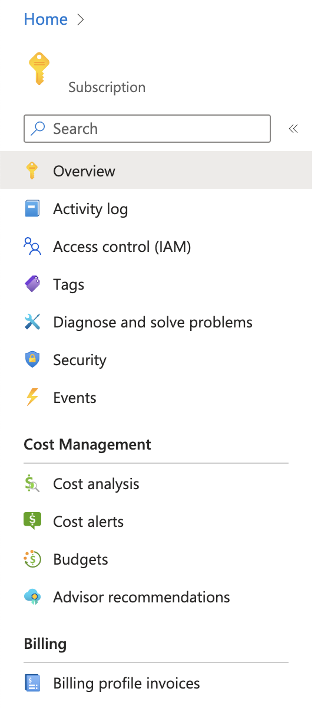
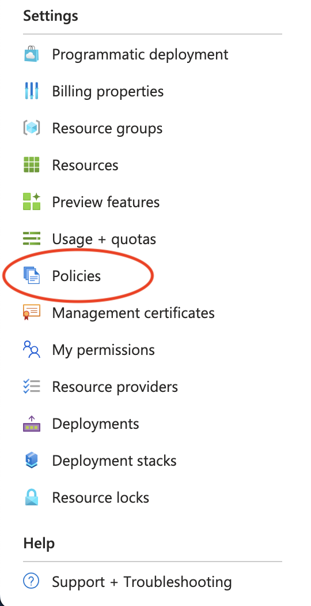

---


### **[Azure Policy: Definition](https://learn.microsoft.com/en-us/azure/governance/policy/policy-glossary#definition)**

#### Establishes conventions for resources.

[](https://learn.microsoft.com/en-us/azure/governance/policy/concepts/definition-structure)

<!--
Some speaker notes here that might be useful.

A JSON-defined object that describes a policy, including resource compliance requirements and the effect to take if they are violated. Learn more about the policy definition JSON structure here: Azure Policy definition structure.

Azure Policy establishes conventions for resources. Policy definitions describe resource compliance conditions and the effect to take if a condition is met. A condition compares a resource property field or a value to a required value.
-->

---


### **[Azure Policy: Effects](https://learn.microsoft.com/en-us/azure/governance/policy/policy-glossary#definition)**

#### What happens when the policy rule is matched?

[](https://learn.microsoft.com/en-us/azure/governance/policy/concepts/effects)

<!--
Some speaker notes here that might be useful.
-->

---


## Demonstration: <br/> Built-In Azure Policy Definition on Azure Portal

---

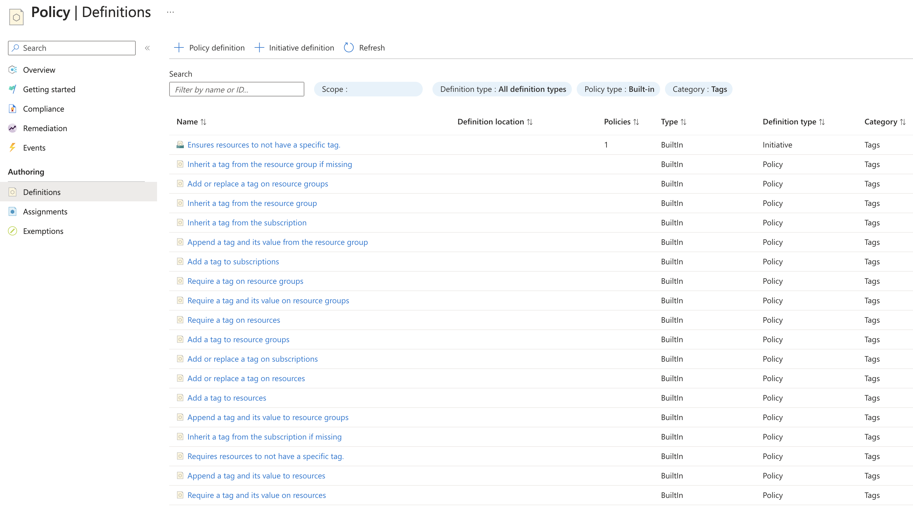

<style scoped>img[alt="image"] {
    border: 3px solid #008AD7;
    width: 90%;
}
</style>

---

### **[Azure Policy: BuiltIn Definition](https://learn.microsoft.com/en-us/azure/governance/policy/policy-glossary#definition)**

```powershell
Get-AzPolicyDefinition -BuiltIn `
    | Where-Object {$_.Properties.metadata.category -eq 'Tags'} `
    | Select-Object -ExpandProperty properties `
    | Select-Object -Property DisplayName `
    | Format-List

# OR

    | Where-Object {$_.Properties.metadata.category -eq 'Storage'} `

# OR

    | Where-Object {$_.Properties.metadata.category -eq 'Regulatory Compliance'} `
```

---

### **[Azure Policy: BuiltIn Definition](https://learn.microsoft.com/en-us/azure/governance/policy/policy-glossary#definition)**

```powershell
$policyDefinition = Get-AzPolicyDefinition `
    -BuiltIn | Where-Object `
    {$_.Properties.DisplayName -eq 'Require a tag on resources'}

# OR

    {$_.Properties.DisplayName -eq 'Allowed locations for resource groups'}

# OR

    {$_.Properties.DisplayName -eq 'Allowed locations'}
```

---

### **[Azure Policy: Custom Definition (Tags)](https://learn.microsoft.com/en-us/azure/governance/policy/policy-glossary#definition)**

```json
{
    "properties": {
        "displayName": "AuditResourcesTags",
        "policyType": "Custom",
        "mode": "All",
        "description": "Enforces required tags and its value on resources.",
        "metadata": {
            "version": "1.0.0",
            "category": "Tags"
        },
        //...
```

---

```json
        //... tagName1, tagValue1, tagName2, tagValue2, etc.
        "parameters": {
            //...
            "tagName5": {
                "type": "String",
                "metadata": {
                    "displayName": "Fifth Tag Name",
                    "description": "Name of the tag, such as 'environment'."
                }
            },
            "tagValue5": {
                "type": "String",
                "metadata": {
                    "displayName": "Fifth Tag Value",
                    "description": "Value of the tag, such as 'production'."
                }
            }
        },
        //...
```

---

```json
        //...
        "policyRule": {
            "if": {
                "not": {
                    "anyOf": [
                        //... tagName1, tagName2, etc.
                        {
                            "field": "[concat('tags[', parameters('tagName5'), ']')]",
                            "equals": "[parameters('tagValue5')]"
                        }
                    ]
                }
            },
            "then": { "effect": "audit" }
        }
    }
}
```

---

### **[Azure Policy: Custom Definition](https://learn.microsoft.com/en-us/azure/governance/policy/policy-glossary#definition)**

#### What about Resource Groups?

---

```json
        //...
        "policyRule": {
            "if": {
                "allOf": [
                    {
                        "field": "type",
                        "equals": "Microsoft.Resources/subscriptions/resourceGroups"
                    },
                    {
                        "not": {
                            "anyOf": [
                                //... tagName1, tagName2, etc.
                                {
                                    "field": "[concat('tags[', parameters('tagName5'), ']')]",
                                    "equals": "[parameters('tagValue5')]"
                                }
                            ]
                        }
                    }
                ]
            },
            "then": { "effect": "audit" }
        }
    }
}
```

---

### **[Azure Policy: Custom Definition (DenyAction)](https://learn.microsoft.com/en-us/azure/governance/policy/policy-glossary#definition)**

```json
{
    "properties": {
        "displayName": "DenyActionDelete",
        "policyType": "Custom",
        "mode": "Indexed",
        "description": "Deny action delete for critical resources.",
        "metadata": {
            "version": "1.0.0",
            "category": "DenyAction"
        },
        //...
```

---

```json
        // ...
        "parameters": {},
        "policyRule": {
            "if": {
                "anyOf": [
                    {
                        "field": "type",
                        "equals": "Microsoft.DocumentDB/databaseAccounts"
                    },
                    {
                        "field": "type",
                        "equals": "Microsoft.Storage/storageAccounts"
                    },
                    {
                        "field": "type",
                        "equals": "Microsoft.KeyVault/vaults"
                    }
                ]
            },
            // ...
```

---

```json
            // ...
            "then": {
                "effect": "DenyAction",
                "details": {
                    "actionNames": [
                        "delete"
                    ],
                    "cascadeBehaviors": {
                        "resourceGroup": "deny"
                    }
                }
            }
        }
    }
}
```

---

### **[Azure Policy: Create Custom Definition](https://learn.microsoft.com/en-us/azure/governance/policy/policy-glossary#definition)**

```powershell
New-AzPolicyDefinition `
        -Name $name `
        -Policy $policyFilePath `
        -SubscriptionId $subscriptionId
```

---


### **[Azure Policy: Assignment](https://learn.microsoft.com/en-us/azure/governance/policy/policy-glossary#assignment)**

#### Determines the resources to which a policy definition is applied.

[](https://learn.microsoft.com/en-us/azure/governance/policy/concepts/assignment-structure)

<!--
Some speaker notes here that might be useful.

A JSON-defined object that determines the resources to which a policy definition is applied. Learn more about the policy assignment JSON structure here: Azure Policy assignment structure.

Policy assignments are used by Azure Policy to define which resources are assigned which policies or initiatives. The policy assignment can determine the values of parameters for that group of resources at assignment time, making it possible to reuse policy definitions that address the same resource properties with different needs for compliance.
-->

---


## Demonstration: <br/> Azure Policy Assignments on Azure Portal

---

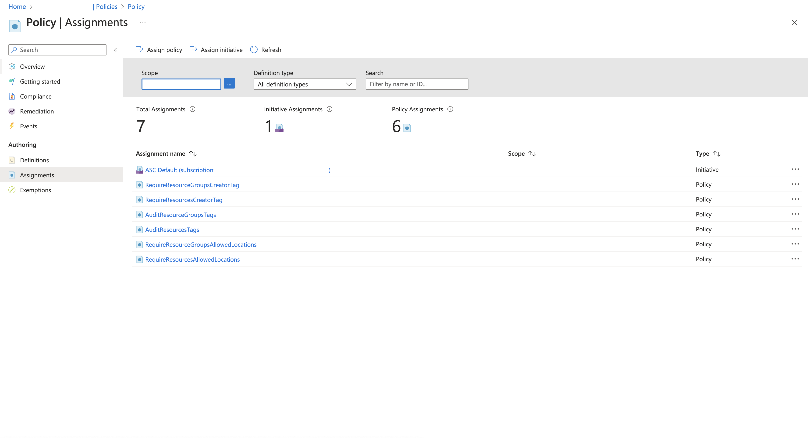

<style scoped>img[alt="image"] {
    border: 3px solid #008AD7;
    width: 90%;
}
</style>

---

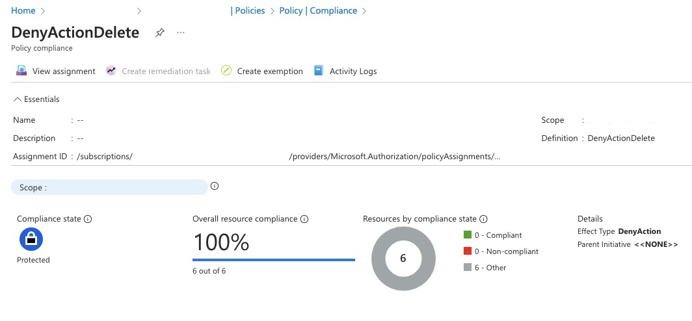

<style scoped>img[alt="image"] {
    border: 3px solid #008AD7;
    width: 90%;
}
</style>

---

Exhibit: Azure Policy Assignment
Require resources to have a 'Creator` tag.

```powershell
$policyParameterObject = @{ 'tagName' = 'Creator' }

$message="Creator tag is required for resources."
$nonComplianceMessages = @( @{Message=$message} )

$policyAssignment = New-AzPolicyAssignment `
        -Name $REQUIRE_RESOURCES_CREATOR_TAG `
        -Scope "/subscriptions/$($azContext.Subscription.Id)" `
        -PolicyDefinition $policyDefinition `
        -PolicyParameterObject $policyParameterObject `
        -NonComplianceMessage $nonComplianceMessages
```

---

Exhibit: Azure Policy Assignment
Require resources reside in allowed locations.

```powershell
$allowedLocations = Get-AzLocation `
    | Where-Object `
    {($_.DisplayName -like '*europe*') -or ($_.DisplayName -like '*norway*')}

$policyParameterObject = @{'listOfAllowedLocations'=($allowedLocations.location)}

$message="The selected locations are not allowed for resources."
$nonComplianceMessages = @( @{Message=$message} )

$policyAssignment = New-AzPolicyAssignment `
    -Name $REQUIRE_RESOURCES_ALLOWED_LOCATIONS `
    -Scope "/subscriptions/$($azContext.Subscription.Id)" `
    -PolicyDefinition $policyDefinition `
    -PolicyParameterObject $policyParameterObject `
    -NonComplianceMessage $nonComplianceMessages
}
```

---

Exhibit: Azure Policy Assignment
Audit resources to have the five tags. (Part 1/2)

```powershell
$policyParameterObject = @{
    'tagName1' = 'Organization'
    'tagValue1' = 'Acme Corporation'
    'tagName2' = 'BusinessUnit'
    'tagValue2' = 'Road Runner'
    'tagName3' = 'ProjectOwner'
    'tagValue3' = 'Wile E. Coyote'
    'tagName4' = 'Application'
    'tagValue4' = 'Beep-Beep!'
    'tagName5' = 'Environment'
    'tagValue5' = 'Fast and Furry-ous'
}
```

---

Exhibit: Azure Policy Assignment
Audit resources to have the five tags. (Part 2/2)

```powershell
$message="Required tags and its values are needed for resources."
$nonComplianceMessages = @( @{Message=$message} )

$policyAssignment = New-AzPolicyAssignment `
    -Name $AUDIT_RESOURCES_TAGS `
    -Scope "/subscriptions/$($azContext.Subscription.Id)" `
    -PolicyDefinition $policyDefinition `
    -PolicyParameterObject $policyParameterObject `
    -NonComplianceMessage $nonComplianceMessages
```

---

Exhibit: Azure Policy Assignment
DenyAction Delete

```powershell
$message="Deny action delete for critical resources."
$nonComplianceMessages = @( @{Message=$message} )

$policyAssignment = New-AzPolicyAssignment `
    -Name $policyDefinition.Name `
    -Scope "/subscriptions/$($azContext.Subscription.Id)" `
    -PolicyDefinition $policyDefinition `
    -NonComplianceMessage $nonComplianceMessages
```

---


## Demonstration: <br/> Create resources that violates Azure Policy on Azure Portal.

---

Exhibit: Missing Required Tag

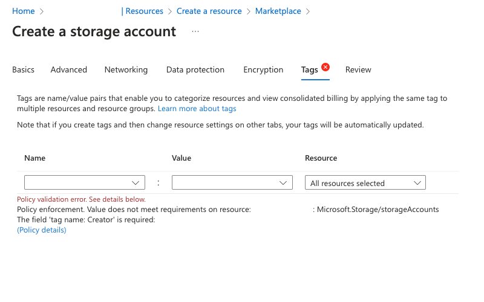

<style scoped>img[alt="image"] {
    border: 3px solid #008AD7;
    width: 70%;
}
</style>

---

Exhibit: Missing Allowed Locations

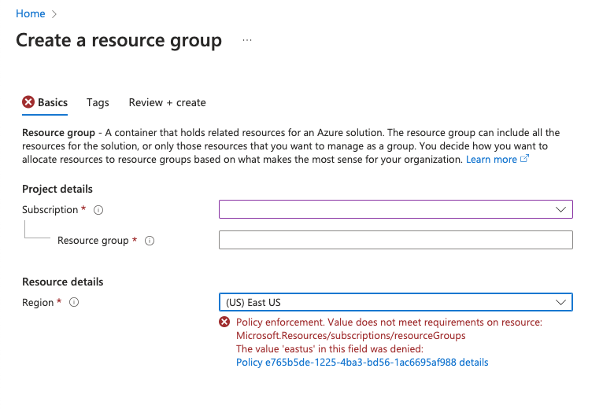

<style scoped>img[alt="image"] {
    border: 3px solid #008AD7;
    width: 65%;
}
</style>

---

Exhibit: DenyAction Delete

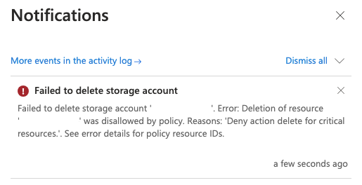

<style scoped>img[alt="image"] {
    border: 3px solid #008AD7;
    width: 65%;
}
</style>

---


## Demonstration: <br/> Create resources that violates Azure Policy through Infrastructure as Code.

---

## <!--fit--> :muscle:

---

Exhibit: [Azure Resource Manager (ARM) Templates](https://github.com/Azure/azure-quickstart-templates/blob/b41b420ccb55ff45a032b83b2f85e65d6fa16aae/quickstarts/microsoft.storage/storage-account-create/azuredeploy.json)

```json
{
  "$schema": "https://schema.management.azure.com/schemas/2019-04-01/deploymentTemplate.json#",
  "contentVersion": "1.0.0.0",

  //...

  "resources": [
    {
      "name": "[format('store{0}', uniqueString(resourceGroup().id))]",
      "type": "Microsoft.Storage/storageAccounts",
      "apiVersion": "2022-09-01",
      "tags": {},
      "location": "[resourceGroup().location]",
      "kind": "StorageV2",
      "sku": {
        "name": "[parameters('storageAccountType')]"
      }
    }
  ],
  "outputs": {}
}
```

<!--
https://github.com/Azure/azure-quickstart-templates/blob/master/quickstarts/microsoft.storage/storage-account-create/azuredeploy.json
-->

---


<style scoped>img[alt="giffiti"] {
    border: 3px solid #008AD7;
    width: 80%;
}
</style>

---


<!--
You can think of Bicep as a revision to the existing Azure Resource Manager template (ARM template) language rather than a new language.

Bicep is a domain-specific language (DSL) that uses declarative syntax to deploy Azure resources. In a Bicep file, you define the infrastructure you want to deploy to Azure, and then use that file throughout the development lifecycle to repeatedly deploy your infrastructure. Your resources are deployed in a consistent manner.

Support for all resource types and API versions: Bicep immediately supports all preview and GA versions for Azure services. As soon as a resource provider introduces new resource types and API versions, you can use them in your Bicep file. You don't have to wait for tools to be updated before using the new services.

Simple syntax: When compared to the equivalent JSON template, Bicep files are more concise and easier to read. Bicep requires no previous knowledge of programming languages. Bicep syntax is declarative and specifies which resources and resource properties you want to deploy.
-->

---

Exhibit: [Azure Bicep](https://github.com/Azure/azure-quickstart-templates/blob/b41b420ccb55ff45a032b83b2f85e65d6fa16aae/quickstarts/microsoft.storage/storage-account-create/main.bicep) Storage Account Without Tags

```bicep
resource storageAccount 'Microsoft.Storage/storageAccounts@2021-04-01' = {
  name: uniqueStorageName
  location: location
  sku: {
    name: storageSKU
  }
  kind: 'StorageV2'
  properties: {
    supportsHttpsTrafficOnly: true
  }
  tags: null
}
```

<!--
https://github.com/Azure/azure-quickstart-templates/blob/master/quickstarts/microsoft.storage/storage-account-create/main.bicep
-->

---

Exhibit: Terraform Storage Account Without Tags

```terraform
resource "azurerm_storage_account" "deleteme654" {
  name                     = "deleteme654"
  resource_group_name      = azurerm_resource_group.example.name
  location                 = azurerm_resource_group.example.name
  account_tier             = "Standard"
  account_replication_type = "LRS"
  tags                     = null
}
```

---

```json
[
    {
        "info": {
            "evaluationDetails": {
                "evaluatedExpressions": [
                    {
                        "expression": "tags[Creator]",
                        "expressionKind": "Field",
                        "operator": "Exists",
                        "path": "tags[Creator]",
                        "result": "True",
                        "targetValue": "false"
                    }
                ],
                "reason": "Creator tag is required for resources."
            },
            "policyAssignmentId": ".../policyAssignments/RequireResourcesCreatorTag",
            "policyAssignmentName": "RequireResourcesCreatorTag",
            "policyAssignmentParameters": {
                "tagName": "Creator"
            },
            "policyAssignmentScope": "/subscriptions/***",
            "policyDefinitionDisplayName": "Require a tag on resources",
            "policyDefinitionEffect": "deny",
            "policyDefinitionId": "...",
            "policyDefinitionName": "871b6d14-10aa-478d-b590-94f262ecfa99",
            "policyExemptionIds": []
        },
        "type": "PolicyViolation"
    }
]
```

---

Exhibit: Azure Bicep

Resource Group not in Allowed Locations

```bicep
resource newRG 'Microsoft.Resources/resourceGroups@2021-01-01' = {
  name: resourceGroupName
  location: 'Taiwan North'
}
```

---

Exhibit: Terraform

Resource Group not in Allowed Locations

```terraform
resource "azurerm_resource_group" "deleteme987" {
  name     = "deleteme987"
  location = "Taiwan North"
}
```

---

```json
[
  {
    "info": {
      "evaluationDetails": {
        "evaluatedExpressions": [
          {
            "expression": "type",
            "expressionKind": "Field",
            "expressionValue": "Microsoft.Resources/subscriptions/resourcegroups",
            "operator": "Equals",
            "path": "type",
            "result": "True",
            "targetValue": "Microsoft.Resources/subscriptions/resourceGroups"
          },
          {
            "expression": "location",
            "expressionKind": "Field",
            "expressionValue": "taiwannorth",
            "operator": "NotIn",
            "path": "location",
            "result": "True",
            "targetValue": [
              "northeurope",
              "westeurope",
              "norwayeast",
              "europe",
              "norway",
              "norwaywest"
            ]
          }
        ],
        "reason": "The selected locations are not allowed for resource groups."
      },
      //...
```

---

```json
      //...
      "policyAssignmentId": ".../policyAssignments/RequireResourceGroupsAllowedLocations",
      "policyAssignmentName": "RequireResourceGroupsAllowedLocations",
      "policyAssignmentParameters": {
        "listOfAllowedLocations": [
          "northeurope",
          "westeurope",
          "norwayeast",
          "europe",
          "norway",
          "norwaywest"
        ]
      },
      "policyAssignmentScope": "/subscriptions/***",
      "policyDefinitionDisplayName": "Allowed locations for resource groups",
      "policyDefinitionEffect": "deny",
      "policyDefinitionId": "...",
      "policyDefinitionName": "e765b5de-1225-4ba3-bd56-1ac6695af988",
      "policyExemptionIds": []
    },
    "type": "PolicyViolation"
  }
]

```

---

Exhibit: DenyAction Delete for Storage Account

```json
[
    {
        "info": {
            "evaluationDetails": {
                "evaluatedExpressions": [
                    {
                        "expression": "type",
                        "expressionKind": "Field",
                        "expressionValue": "Microsoft.Storage/storageAccounts",
                        "operator": "Equals",
                        "path": "type",
                        "result": "True",
                        "targetValue": "Microsoft.Storage/storageAccounts"
                    }
                ],
                "reason": "Deny action delete for critical resources."
            },
            // ...
```

---

```json
            // ...
            "policyAssignmentId": ".../policyAssignments/DenyActionDelete",
            "policyAssignmentName": "DenyActionDelete",
            "policyAssignmentParameters": {},
            "policyAssignmentScope": "/subscriptions/***",
            "policyDefinitionDisplayName": "DenyActionDelete",
            "policyDefinitionEffect": "DenyAction",
            "policyDefinitionId": "/...",
            "policyDefinitionName": "DenyActionDelete",
            "policyExemptionIds": []
        },
        "type": "PolicyViolation"
    }
]
```

---

Agility


Governance

<style scoped>img[alt="image"] {
    width: 35%;
    float: center;
}
</style>

---

### <!--fit--> :thinking: :question:

<!--
Some speaker notes here that might be useful.
-->

---


<!--
Some speaker notes here that might be useful.
-->

---


<!--
Some speaker notes here that might be useful.
-->

### <!--fit--> :pray:

<!--
Some speaker notes here that might be useful.

Thank You!
-->

---


---

This page intentionally left blank.

<!--
Some speaker notes here that might be useful.
-->
