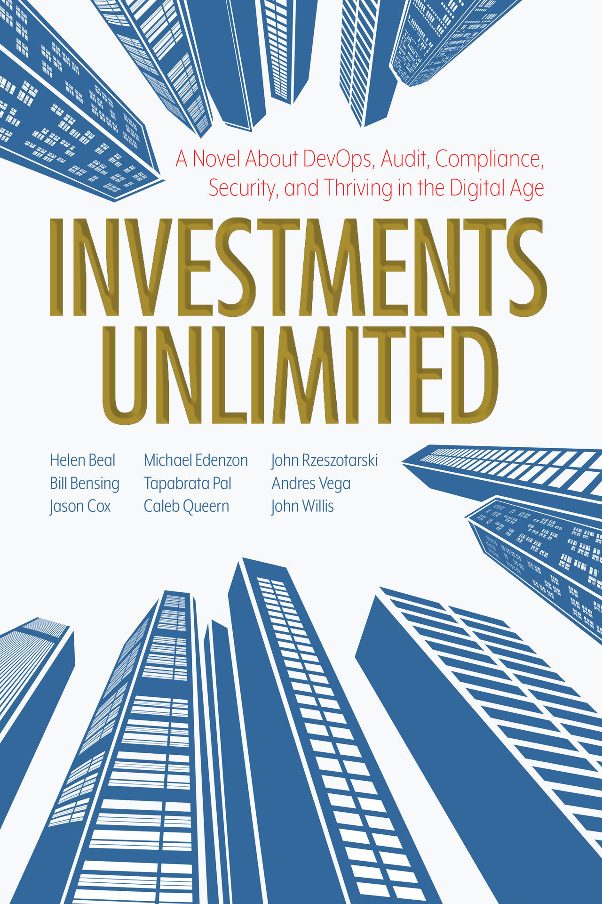

# <!--fit--> Getting Started with   Compliance & Governance  using Azure Policy

<!--
Some speaker notes here that might be useful.
-->

---

## <!--fit--> :raising_hand_man: :raising_hand: :raising_hand_woman:

<!--
Some speaker notes here that might be useful.
-->

---

### DevOps   Site Reliability Engineering   Platform Engineering   Governance Engineering

<!--
Some speaker notes here that might be useful.

Gartner Top 10 Strategic Technology Trends for 2023
https://www.gartner.com/en/articles/gartner-top-10-strategic-technology-trends-for-2023

Platform Engineering provides a curated set of tools, capabilities and processes that are packaged for easy consumption by developers and end users. It will increase end users’ productivity and reduce the burden on development teams.
-->

---

<!--
Some speaker notes here that might be useful.

The Phoenix Project: A Novel about IT, DevOps, and Helping Your Business Win
Publisher : IT Revolution Press; Reprint edition (October 16, 2014)

The DevOps Handbook: How to Create World-Class Agility, Reliability, & Security in Technology Organizations
Publisher : IT Revolution Press; Illustrated edition (October 6, 2016)

Accelerate: The Science of Lean Software and DevOps: Building and Scaling High Performing Technology Organizations
Publisher : IT Revolution Press; 1st edition (March 27, 2018)

The Unicorn Project
Publisher : IT Revolution Press (November 26, 2019)
-->

---

“Good strategy and good governance are the grease and guide rails for success.” - [Bill Bensing](https://www.amazon.com/Investments-Unlimited-Compliance-Thriving-Digital/dp/1950508536)

<!--
Some speaker notes here that might be useful.

In the vein of the bestselling The Phoenix Project and The Unicorn Project, Investments Unlimited radically rethinks how organizations can handle the audit, compliance, and security of their software systems―even in highly regulated industries. By introducing concepts, tools, and ideas to reimagine governance, Investments Unlimited catalyzes a more humane way to enable high-velocity software delivery that is inherently more secure.

While features moved through the organization swiftly, their governance process became inundated with friction, frustration, and failure. And now, their inability to deliver what they promise has led regulators to slap them with an MRIA (matter requiring immediate attention), the final warning before cease-and-desist letters and fire sales.
-->

---

## Governance Engineering

[Applying SRE Principles to Regulated Software - Bill Bensing](https://itrevolution.com/articles/governance-engineering/)

---

## Governance Engineering

[Under Control: Why Governance Engineering is Coming to Cloud Native - Ian Miell](https://blog.container-solutions.com/under-control-why-governance-engineering-is-coming-to-cloud-native)

<!--
Some speaker notes here that might be useful.

- Git: Code
- Jenkins: Build
- Terraform: Provision
- Docker: Encapsulation
- Kubernetes: Apotheosis / Culmination of Cloud Native Philosophy

Emphasising the importance of software platform delivery as code that can be stored and managed in an auditable source control.

Relatively impervious to automation has been the Governance, Risk and Compliance (GRC) areas of IT service management. For example, finance and health organisations.

So far, engineers have shown little interest in tackling this problem, perhaps because controls are seen as stifling rather than enabling, and ‘managing risk’ via controls is less intellectually challenging to master than security issues such as supply chain management or vulnerability detection.

However, that may change soon.
-->

---

## Governance Engineering

#### [Digital Operational Resilience Act (DORA)](https://eur-lex.europa.eu/eli/reg/2022/2554/oj)

"To put it plainly, regulators are going to expect compliance and audit functions to have the ability to report on their controls regularly, efficiently and clearly." - [Ian Miell](https://blog.container-solutions.com/under-control-why-governance-engineering-is-coming-to-cloud-native)

<!--
Some speaker notes here that might be useful.

Although the act is slated to become law from January 17, 2025, the technical standards are expected to be published ‘in tranches from January 17, 2024’, so the detail isn’t known yet.
-->

---

## Governance Engineering

#### Controls   Description vs. Implementation

"Efficiency and Speed, Accuracy and Consistency, Transparency, Scalability, and Adaptability." - [Ian Miell](https://blog.container-solutions.com/under-control-why-governance-engineering-is-coming-to-cloud-native)

<!--
Some speaker notes here that might be useful.

At the moment, audits of controls take place on a cadence in the years, and are carried out ‘by hand’ by auditors whose job it is to seek out evidence of the adherence to, and effectiveness of, controls.
-->

---

## **[Azure Policy](https://learn.microsoft.com/en-us/azure/governance/policy/overview)**

#### Enforce Standards & Assess Compliance

<!--
Some speaker notes here that might be useful.

A service that enables users to govern Azure resources by enforcing organizational standards and assessing compliance at scale.

Common use cases for Azure Policy include implementing governance for resource consistency, regulatory compliance, security, cost, and management. Policy definitions for these common use cases are already available in your Azure environment as built-ins to help you get started.
-->

---

## **[Azure Policy: Definition](https://learn.microsoft.com/en-us/azure/governance/policy/policy-glossary#definition)**

#### Establishes Conventions for Resources

<!--
Some speaker notes here that might be useful.

A JSON-defined object that describes a policy, including resource compliance requirements and the effect to take if they are violated. Learn more about the policy definition JSON structure here: Azure Policy definition structure.

Azure Policy establishes conventions for resources. Policy definitions describe resource compliance conditions and the effect to take if a condition is met. A condition compares a resource property field or a value to a required value.
-->

---

## **[Azure Policy: Assignment](https://learn.microsoft.com/en-us/azure/governance/policy/policy-glossary#assignment)**

#### Determines Resources where Definition is Applied

<!--
Some speaker notes here that might be useful.

A JSON-defined object that determines the resources to which a policy definition is applied. Learn more about the policy assignment JSON structure here: Azure Policy assignment structure.

Policy assignments are used by Azure Policy to define which resources are assigned which policies or initiatives. The policy assignment can determine the values of parameters for that group of resources at assignment time, making it possible to reuse policy definitions that address the same resource properties with different needs for compliance.
-->

---

### <!--fit--> :question:

<!--
Some speaker notes here that might be useful.
-->

---

<!--
Some speaker notes here that might be useful.
-->

---

<!--
Some speaker notes here that might be useful.
-->

### <!--fit--> :pray:

<!--
Some speaker notes here that might be useful.

Thank You!
-->

---

---

This page intentionally left blank.

<!--
Some speaker notes here that might be useful.
-->
